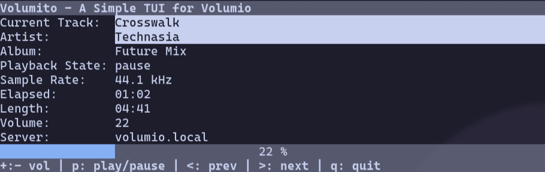
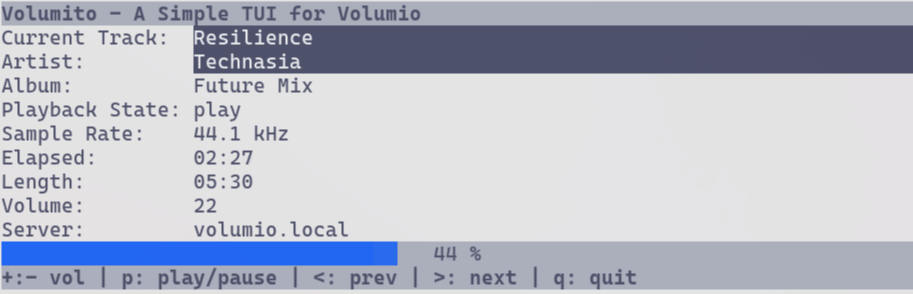

# volumito
A TUI remote controller for Volumio

## Requirements
   - Linux/MacOS (tested with alacritty)
   - Python3
   - Volumio (tested with v4+)

## Install
   - clone this repository
   - python -m venv venv
   - source venv/bin/activate
   - run "python volumito.py" - at the initial run it will create a configuration file in _$HOME/.config_. Edit if necessary and run again!

## Screenshots

